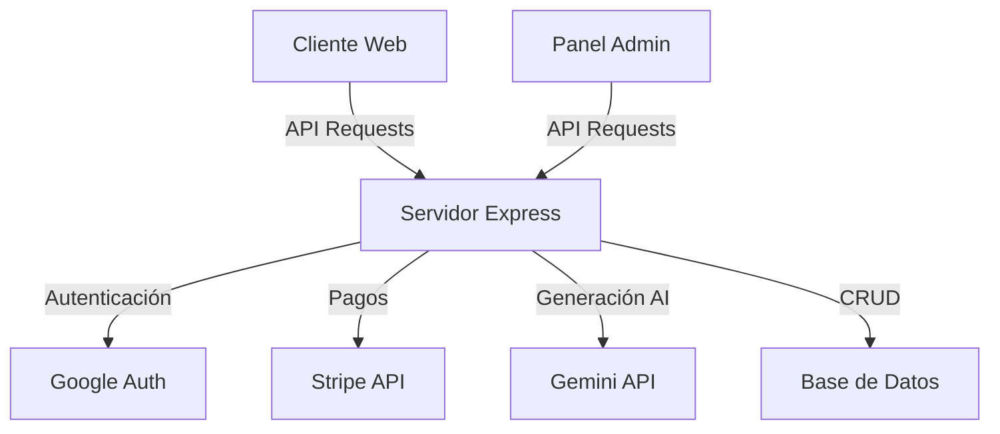

# Diseño del Sistema de Monetización

## Overview

Este documento describe el diseño técnico para mejorar el sistema de monetización de ListosApp. La solución propuesta reemplazará el actual sistema basado en localStorage con una arquitectura más robusta que utiliza una base de datos persistente para almacenar información de suscripciones y usuarios. También se implementarán mejoras en la experiencia de usuario durante el proceso de pago y se añadirá un panel de administración para gestionar suscripciones y analizar métricas.

## Arquitectura

La arquitectura del sistema se basará en un modelo cliente-servidor con los siguientes componentes principales:



### Componentes Principales:

1. **Cliente Web**: La aplicación React existente con mejoras en la UI para el proceso de suscripción.
2. **Servidor Express**: Ampliado para manejar la persistencia de datos y la lógica de negocio relacionada con suscripciones.
3. **Base de Datos**: Nueva adición para almacenar información de usuarios y suscripciones de forma persistente.
4. **Integración con Stripe**: Mejorada para manejar webhooks y eventos de suscripción.
5. **Panel de Administración**: Nueva interfaz para gestionar usuarios y suscripciones.

## Components and Interfaces

### 1. Modelo de Datos

#### Usuario
```typescript
interface User {
  id: string;           // ID de Google
  email: string;        // Email del usuario
  name: string;         // Nombre completo
  picture: string;      // URL de la imagen de perfil
  createdAt: Date;      // Fecha de creación
  lastLogin: Date;      // Último inicio de sesión
  role: 'user' | 'admin'; // Rol del usuario
}
```

#### Suscripción
```typescript
interface Subscription {
  id: string;           // ID único
  userId: string;       // ID del usuario
  status: 'active' | 'canceled' | 'expired'; // Estado de la suscripción
  stripeCustomerId: string;    // ID del cliente en Stripe
  stripeSubscriptionId: string; // ID de la suscripción en Stripe
  createdAt: Date;      // Fecha de inicio
  currentPeriodEnd: Date; // Fecha de fin del período actual
  cancelAtPeriodEnd: boolean; // Si se cancelará al final del período
}
```

#### Uso
```typescript
interface Usage {
  id: string;           // ID único
  userId: string;       // ID del usuario
  documentType: 'worksheet' | 'exam'; // Tipo de documento
  createdAt: Date;      // Fecha de creación
  metadata: Record<string, any>; // Metadatos adicionales
}
```

### 2. API Endpoints

#### Autenticación y Usuario
- `GET /api/user/profile`: Obtener perfil de usuario con estado de suscripción
- `POST /api/user/login`: Iniciar sesión con Google

#### Suscripciones
- `GET /api/subscription/status`: Verificar estado de suscripción
- `POST /api/subscription/create`: Crear nueva suscripción
- `POST /api/subscription/cancel`: Cancelar suscripción existente

#### Webhooks
- `POST /api/webhooks/stripe`: Recibir eventos de Stripe

#### Admin
- `GET /api/admin/users`: Listar usuarios
- `GET /api/admin/subscriptions`: Listar suscripciones
- `GET /api/admin/analytics`: Obtener métricas y análisis
- `POST /api/admin/user/:id/subscription`: Modificar suscripción de usuario

### 3. Componentes de UI

#### Cliente
- `SubscriptionBanner`: Muestra estado actual y beneficios
- `PaymentModal`: Interfaz mejorada para el proceso de pago
- `SubscriptionSettings`: Gestión de suscripción para usuarios
- `UsageCounter`: Indicador de uso para usuarios gratuitos

#### Admin
- `AdminDashboard`: Panel principal con métricas
- `UserManagement`: Gestión de usuarios
- `SubscriptionManagement`: Gestión de suscripciones
- `AnalyticsView`: Visualización de métricas y reportes

## Data Models

### Esquema de Base de Datos

Utilizaremos Firestore como base de datos NoSQL para almacenar la información de usuarios y suscripciones. A continuación se presenta el esquema de colecciones:

#### Colección: users
```
{
  id: string,           // ID de Google (documento ID)
  email: string,        // Email del usuario
  name: string,         // Nombre completo
  picture: string,      // URL de la imagen de perfil
  createdAt: timestamp, // Fecha de creación
  lastLogin: timestamp, // Último inicio de sesión
  role: string,         // 'user' o 'admin'
  worksheetCount: number // Contador de documentos generados (para usuarios gratuitos)
}
```

#### Colección: subscriptions
```
{
  id: string,           // ID único (documento ID)
  userId: string,       // ID del usuario
  status: string,       // 'active', 'canceled', 'expired'
  stripeCustomerId: string,    // ID del cliente en Stripe
  stripeSubscriptionId: string, // ID de la suscripción en Stripe
  createdAt: timestamp, // Fecha de inicio
  currentPeriodEnd: timestamp, // Fecha de fin del período actual
  cancelAtPeriodEnd: boolean,  // Si se cancelará al final del período
  plan: string,         // Identificador del plan
  priceId: string       // ID del precio en Stripe
}
```

#### Colección: usage
```
{
  id: string,           // ID único (documento ID)
  userId: string,       // ID del usuario
  documentType: string, // 'worksheet' o 'exam'
  createdAt: timestamp, // Fecha de creación
  subject: string,      // Materia del documento
  grade: string,        // Grado escolar
  language: string      // Idioma del documento
}
```

## Error Handling

### Estrategia de Manejo de Errores

1. **Errores de Cliente**:
   - Validación de formularios antes de enviar al servidor
   - Mensajes de error contextuales y acciones recomendadas
   - Reintentos automáticos para errores de red

2. **Errores de Servidor**:
   - Logging estructurado para todos los errores
   - Respuestas de error estandarizadas con códigos y mensajes
   - Manejo de casos de borde en integraciones de terceros

3. **Errores de Pago**:
   - Captura y registro detallado de errores de Stripe
   - Flujos de recuperación para pagos fallidos
   - Notificaciones a administradores para problemas críticos

### Estructura de Respuesta de Error

```typescript
interface ErrorResponse {
  status: number;       // Código HTTP
  code: string;         // Código interno de error
  message: string;      // Mensaje para el usuario
  details?: any;        // Detalles adicionales (solo desarrollo)
}
```

## Testing Strategy

### Pruebas Unitarias
- Pruebas para servicios de autenticación y suscripción
- Pruebas para componentes de UI relacionados con pagos
- Mocks para APIs externas (Stripe, Google Auth)

### Pruebas de Integración
- Flujos completos de suscripción y pago
- Integración con Stripe en ambiente de pruebas
- Persistencia y recuperación de datos de suscripción

### Pruebas End-to-End
- Flujo completo de usuario desde registro hasta suscripción
- Escenarios de cancelación y renovación
- Pruebas de panel de administración

### Pruebas de Seguridad
- Verificación de permisos para endpoints administrativos
- Validación de tokens de autenticación
- Protección contra ataques comunes (CSRF, XSS)

## Plan de Implementación

La implementación se realizará en fases para minimizar el riesgo y permitir pruebas incrementales:

### Fase 1: Infraestructura de Base de Datos
- Configurar Firestore
- Migrar datos existentes de localStorage
- Implementar servicios básicos de CRUD

### Fase 2: Mejora del Sistema de Suscripciones
- Integrar webhooks de Stripe
- Actualizar flujo de pago
- Implementar verificación de estado de suscripción

### Fase 3: Experiencia de Usuario
- Mejorar UI para proceso de pago
- Añadir indicadores de estado de suscripción
- Implementar notificaciones

### Fase 4: Panel de Administración
- Desarrollar interfaz de administración
- Implementar reportes y análisis
- Configurar permisos y roles

## Consideraciones de Seguridad

1. **Autenticación**:
   - Uso de Firebase Authentication para gestión segura de usuarios
   - Tokens JWT con tiempo de expiración adecuado
   - Verificación de tokens en cada solicitud API

2. **Datos de Pago**:
   - No almacenar información de tarjetas de crédito
   - Usar Stripe Checkout para procesamiento seguro
   - Implementar HTTPS en todas las comunicaciones

3. **Control de Acceso**:
   - Roles de usuario claramente definidos
   - Verificación de permisos en el servidor
   - Limitación de intentos de inicio de sesión

4. **Protección de Datos**:
   - Encriptación de datos sensibles
   - Reglas de seguridad en Firestore
   - Auditoría de accesos a datos sensibles